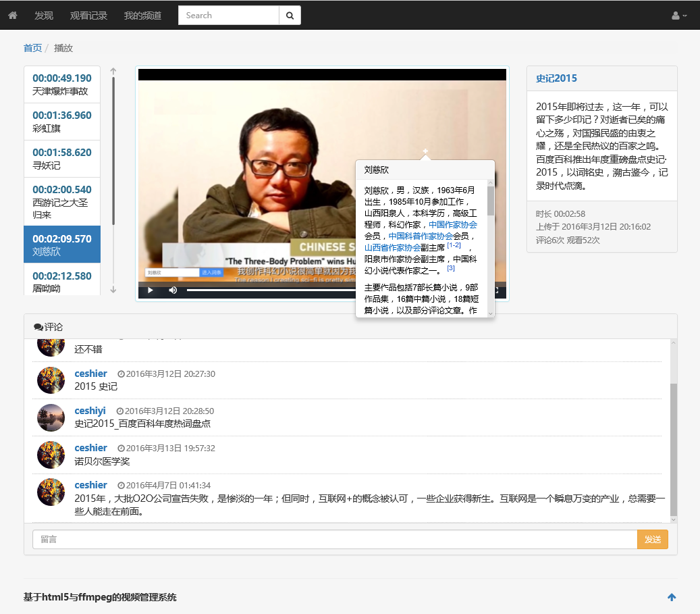
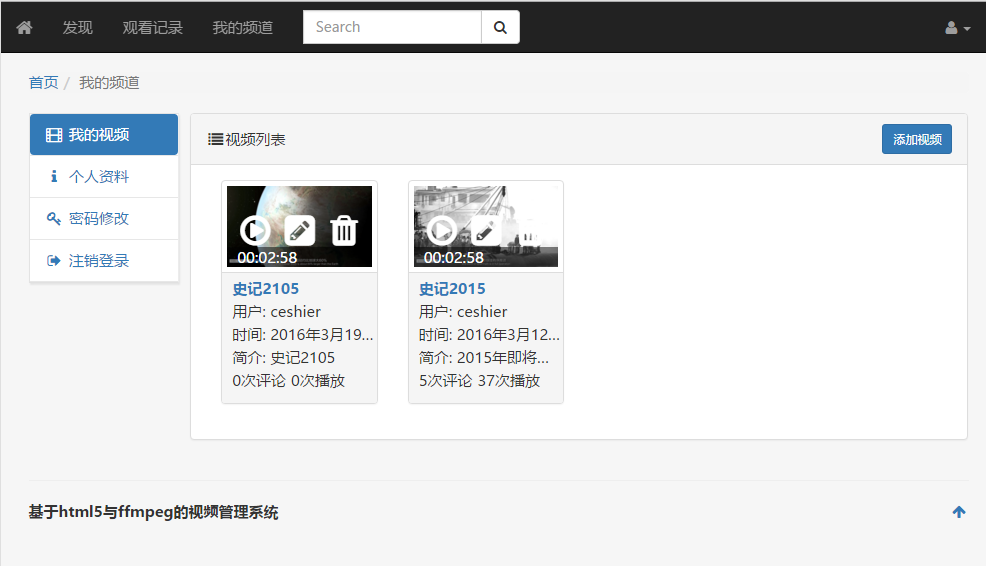

####  视频管理系统
1. 后台：nodejs、express、mongodb、websocket、fluent-ffmpeg、七牛...
2. 前台：reactjs、bootstrap、jquery....
3. 工具：gulp、bower、browserify

####  目录
1. main-station 后台
2. ffmpeg 视频转码
3. qiuniu 上传静态文件到七牛（图片、js、css、视频等文件）

#### 效果图

